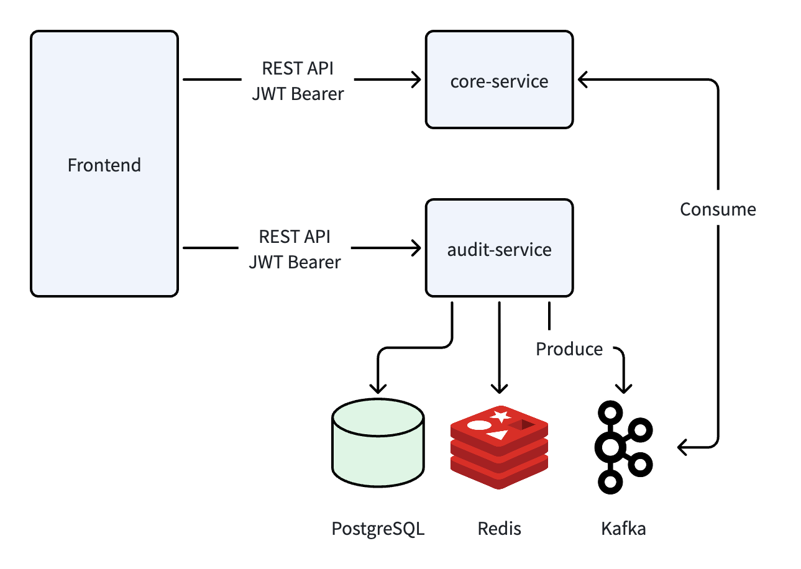
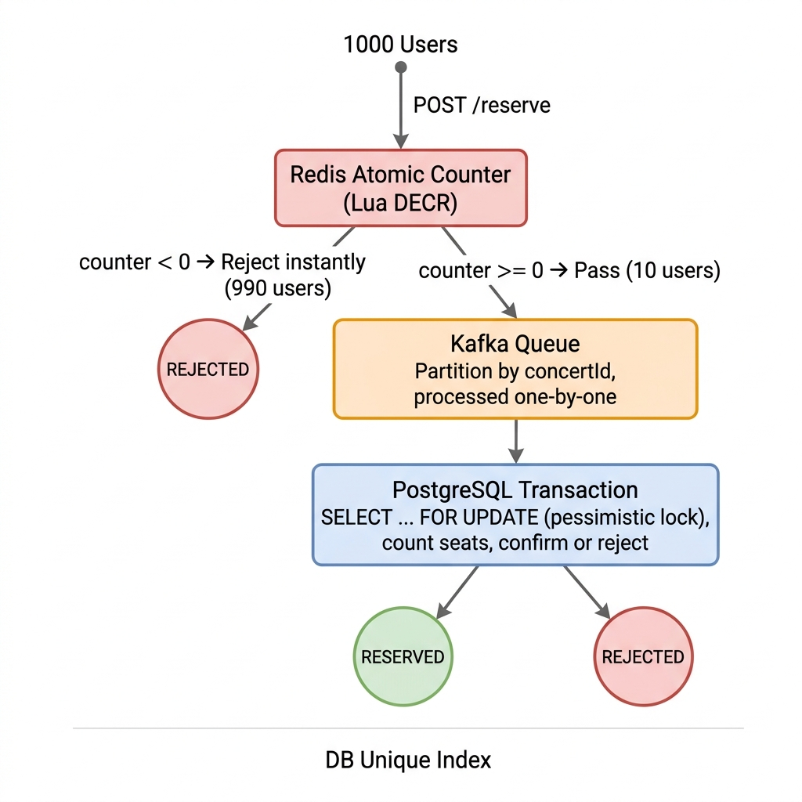

# DataWow Concert Tickets

Free concert ticket reservation system — Next.js 16 + NestJS 11 + PostgreSQL 16

## Architecture



The system is split into 2 independent services:
- **core-service** (`:4000`) — handles auth, concerts, and reservations
- **audit-service** (`:4001`) — consumes audit events from Kafka and stores logs separately

The two services communicate through Kafka topics only — no direct HTTP calls between them.

Infrastructure: PostgreSQL 16, Redis 7 (cache + atomic counter), Redpanda (Kafka-compatible)

## Tech Stack

**Frontend:** Next.js 16 (App Router), Tailwind v4, shadcn/ui, orval (codegen), Vitest

**Backend:** NestJS 11, TypeORM 0.3, Passport-JWT, bcryptjs, class-validator, KafkaJS, nestjs-pino, Swagger

**Infra:** Docker Compose, PostgreSQL 16, Redis 7, Redpanda v24.3

## Getting Started

### Prerequisites
- Node.js 20+, pnpm, Docker

### Option 1: Docker (Recommended)

```bash
docker compose up --build
```

Once ready, open:
- Frontend → http://localhost:3000
- Core API → http://localhost:4000/api
- Audit API → http://localhost:4001/api
- Swagger → http://localhost:4000/api/docs

### Option 2: Run Locally

```bash
# Start infrastructure
docker compose up postgres redis redpanda -d

# core-service
cd core-service && cp .env.example .env && pnpm install && pnpm run start:dev

# audit-service (new terminal)
cd audit-service && cp .env.example .env && pnpm install && pnpm run start:dev

# frontend (new terminal)
cd frontend && cp .env.example .env.local && pnpm install && pnpm run dev
```

Migrations run automatically on startup — no manual steps needed.

### Seed Data

```bash
cd core-service && pnpm run seed
# Creates: admin@datawow.com / Admin123!
```

### Create Accounts Manually

```bash
# Admin
curl -X POST http://localhost:4000/api/auth/register \
  -H "Content-Type: application/json" \
  -d '{"email":"admin@test.com","password":"Admin123","fullName":"Admin","role":"admin"}'

# User
curl -X POST http://localhost:4000/api/auth/register \
  -H "Content-Type: application/json" \
  -d '{"email":"user@test.com","password":"User1234","fullName":"User"}'
```

## API Endpoints

Full Swagger docs available at http://localhost:4000/api/docs

| Method | Endpoint | Access |
|--------|----------|--------|
| POST | `/api/auth/register` | Public |
| POST | `/api/auth/login` | Public |
| GET | `/api/auth/me` | JWT |
| GET | `/api/concerts` | JWT |
| POST | `/api/concerts` | Admin |
| DELETE | `/api/concerts/:id` | Admin |
| GET | `/api/reservations` | Admin |
| POST | `/api/reservations/:concertId` | User |
| DELETE | `/api/reservations/:concertId` | User |
| GET | `/api/reservations/me` | User |
| GET | `/api/audit-logs` (port 4001) | Admin |

## Tests

```bash
# Backend — 137 tests
cd core-service && pnpm test

# Audit — 10 tests
cd audit-service && pnpm test

# Frontend — 40 tests
cd frontend && pnpm test
```

**187 tests** total, covering auth, CRUD, reservation logic, race conditions, guards, error handling, and form validation.

## Bonus 1: Performance Optimization

**Redis Cache** — `GET /concerts` is cached for 30 seconds; invalidated on create/delete/reserve/cancel.

**Redis Lua Atomic Counter** — Lua script performs atomic decrement to check remaining seats. Rejects immediately if sold out, avoiding unnecessary DB queries.

**Rate Limiting** — Global 30 req/min, auth endpoints 5 req/min, reservation endpoints 5 req/min.

**DB Indexing** — Composite index on `(concert_id, status)`, partial unique index on `(user_id, concert_id) WHERE status = 'reserved'`.

**N+1 Prevention** — Concert listing uses a subquery to count reserved seats in a single query instead of N+1 loops.

Future scaling considerations: CDN + ISR, read replicas, PgBouncer, cursor-based pagination.

## Bonus 2: Concurrency Control

**Problem:** 1,000 users simultaneously booking the last 10 seats — how to prevent overbooking?

**Solution:** 4-layer defense, all implemented:



**Layer 1 — Redis Atomic Counter:** Lua script performs atomic `DECR`. If counter < 0, reject immediately without touching the DB. (Filters out ~990 of 1,000 requests instantly.)

**Layer 2 — Kafka Partition:** Requests that pass Redis are published to Kafka, partitioned by `concertId`. This serializes all requests for the same concert, processing them one at a time.

**Layer 3 — PostgreSQL Pessimistic Lock:** The Kafka consumer uses `SELECT ... FOR UPDATE` to lock the concert row, counts actual reserved seats from the DB, then confirms or rejects.

**Layer 4 — Partial Unique Index:** `UNIQUE(user_id, concert_id) WHERE status = 'reserved'` — even if all other layers fail, the DB will never allow duplicates.

The system supports dual-mode: if Kafka is unavailable, it falls back to direct pessimistic locking.

## Project Structure

```
datawow/
├── core-service/          # Main NestJS API (:4000)
│   └── src/
│       ├── auth/          # JWT, guards, decorators
│       ├── concerts/      # CRUD + cache
│       ├── reservations/  # booking logic + cleanup
│       ├── kafka/         # producer + consumer
│       ├── redis/         # Lua seat counter
│       └── common/        # exception filter, error codes
├── audit-service/         # Audit log service (:4001)
│   └── src/
│       ├── audit-log/     # read-only API
│       └── kafka/         # event consumer
├── frontend/              # Next.js 16 (:3000)
│   └── src/
│       ├── app/           # pages (auth, admin, user)
│       ├── api/           # orval generated client
│       ├── components/    # UI + providers
│       └── middleware.ts  # server-side auth guard
└── docker-compose.yml
```
